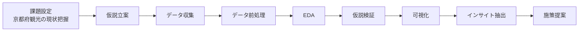

# 京都観光オーバーツーリズム分析

## **プロジェクト概要**
京都府内の観光関連のデータを分析し、 
- 京都市への観光集中
- 地方部への誘客可能性
- 季節ごとの混雑状況 

を可視化し、自治体や観光協会への提案を行う。

---

## **背景**
近年、京都市では外国人観光客の過度な増加により、 
- 公共交通機関の過度な混雑
- 住民生活への影響
- 観光マナー問題
- 観光体験の質の低下 

など、オーバーツーリズムが大きな課題となっている。

一方で、京都府の他地域にも魅力的な観光資源があるにも関わらず、十分な観光客を集められていない地域も存在する。

本プロジェクトでは、観光関連のデータ分析を通じて、
> 「どこへ、いつ、どのように観光客を誘導すべきか」

を明らかにする。

---

## **解決したい問い**

|No.|解決したい問い|理由|
|---|---|---|
|Q1|京都市への観光客集中はどの程度起きているのか|オーバーツーリズムの定量化|
|Q2|地方部で宿泊需要が期待できる自治体はどこか|誘客候補の特定|
|Q3|混雑が発生する季節・時期はいつか|季節に応じた施策の立案|
|Q4|宿泊率は観光消費額に影響しているのか|宿泊促進施策|
|Q5|外国人を地方部に誘導できるか|地域分散|

---
## **仮説**
|No.|仮説|ステータス|
|---|---|---|
|H1|京都市に外国人観光客が過度に集中している|未検証|
|H2|混雑が春・秋に集中する|未検証|
|H3|地方部で宿泊・消費額の伸びが期待できる自治体が存在する|未検証|
|H4|日帰り率が高い自治体は消費額が低い|未検証|
|H5|季節ごとに誘客候補地が異なる|未検証|

---
## **成功指標**
本プロジェクトは、以下を満たした場合に成功とする。
### 1. 観光課題の可視化
- 京都市の観光集中度を定量的に示す
- 混雑する季節・地域を明らかにする
### 2. 仮説の検証
- 設定した仮説についてデータを用いて検証する
- 仮説が支持された場合・されなかった場合の理由を考察する
### 3. インサイトの抽出
- 誘客候補となる自治体を複数提示する
- 消費額向上につながる要因を特定する
### 4. 実行可能な提案
- データに基づく施策を3件以上提案する
- 提案の期待効果も併せて説明する

---
## **データ**
本プロジェクトでは、京都府内の観光状況を分析するため、以下の公開データを利用する。

|データ名|提供元|内容|利用目的|
|---|---|---|---|
|観光入込客数（月別・年別）|京都府|自治体ごとの観光客数|観光客の集中度を把握|
|日帰り客数・宿泊客数|京都府|宿泊・日帰り利用状況|滞在傾向の把握|
|外国人観光客数|京都府|訪日外国人観光客数|インバウンド集中の把握|
|観光目的別人数|京都府|旅行目的の内訳|観光需要の特徴を把握|
|宿泊施設別宿泊客数|京都府|施設種別の宿泊実績|宿泊施設の利用傾向の分析|
|人口|総務省|自治体人口|人口当たり観光客数の算出|
|面積|総務省|自治体面積|観光密度の算出|
|前年同月比|京都府|前年同月との比較|観光需要の増減を把握|

---
## Key Performance Indicators (KPIs)
本プロジェクトでは、京都府内の観光動向やオーバーツーリズムの現状を把握するため、以下のKPIを設定する。これらの指標を用いて、データに基づいた施策につなげる。

| KPI | 定義 | ビジネス上の意味 | 高い場合の解釈 | 低い場合の解釈 | 仮説との関連 |
|---|---|---|---|---|---|
| 観光客数 | 自治体ごとの年間・月間観光客数 | 観光需要の規模を把握する | 観光需要が高く、混雑や経済効果が大きい可能性がある | 観光需要が低く、誘客施策や観光資源の活用余地がある | H1・H2 |
| 外国人観光客比率 | 外国人観光客 ÷ 全観光客 | インバウンド依存度を把握する | インバウンド需要が高く、国際的な人気がある一方、混雑や外部環境の影響を受けやすい | 国内観光客中心であり、インバウンド誘客の余地がある | H1 |
| 宿泊率 | 宿泊客 ÷ 全観光客 | 滞在型観光か日帰り観光かを把握する | 滞在時間が長く、観光消費額の増加が期待できる | 日帰り利用が多く、宿泊促進による消費拡大の余地がある | H3 |
| 日帰り率 | 日帰り客 ÷ 全観光客 | 消費額との関係を分析する | 短時間滞在が中心で、一人当たり消費額が低い可能性がある | 滞在型観光が中心で、地域経済への貢献が期待できる | H4 |
| 観光消費額 | 観光客1人当たり・総消費額 | 地域経済への貢献度を測る | 観光による経済効果が高く、高付加価値な観光が実現できている可能性がある | 消費単価が低く、体験型観光や宿泊促進などによる改善余地がある | H3・H4 |
| 月別観光客数 | 月ごとの観光客数 | 混雑時期・閑散期を把握する | 特定の季節への集中が見られ、混雑対策や分散施策が必要となる可能性がある | 閑散期であり、イベントやプロモーションによる誘客余地がある | H2 |
| 人口あたり観光客数 | 観光客数 ÷ 人口 | 地域への観光負荷を把握する | 住民一人当たりの観光客が多く、オーバーツーリズムの可能性がある | 観光負荷が比較的小さく、さらなる誘客の余地がある | H1 |
| 面積あたり観光客数 | 観光客数 ÷ 面積 | 空間的な混雑度を把握する | 限られたエリアに観光客が集中し、混雑や交通負荷が発生している可能性がある | 観光客が分散しており、混雑リスクが比較的小さい | H1 |

---
## **フローチャート**
本プロジェクトでは、課題の整理から施策提案までを一連の分析プロセスとして進める。以下は、プロジェクト全体の流れを示したロードマップである。

---
## **可視化**
本プロジェクトでは、京都府内の観光動向や自治体ごとの特徴を把握するため、以下の可視化を実施する。

|図|目的|対応する仮説|
|---|---|---|
| 月別観光客数の推移（折れ線グラフ） | 繁忙期・閑散期を把握する | H2 |
| 自治体別観光客数（棒グラフ） | 京都市への観光集中を確認する | H1 |
| 国内・外国人観光客の割合（積み上げ棒グラフ） | 外国人観光客の集中状況を確認する | H1 |
| 宿泊率 × 観光消費額（散布図） | 宿泊率と消費額の関係を分析する | H3 |
| 日帰り率 × 観光消費額（散布図） | 日帰り率が消費額に与える影響を分析する | H4 |
| 自治体別観光客数（地図） | 地域ごとの観光客分布を把握する | H1 |
| 月別・自治体別観光客数（ヒートマップ） | 季節ごとの観光客の偏りを分析する | H2・H5 |
| 誘客候補自治体ランキング（表・棒グラフ） | 今後重点的に誘客すべき自治体を整理する | H5 |

---
## **施策提案**
追記予定

---
## **成果物**
追記予定